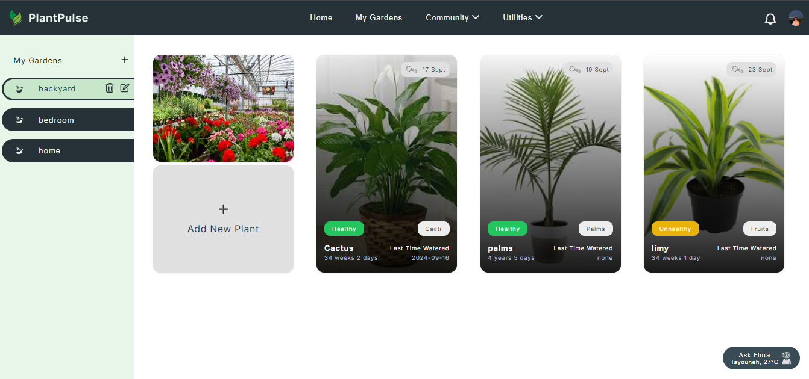
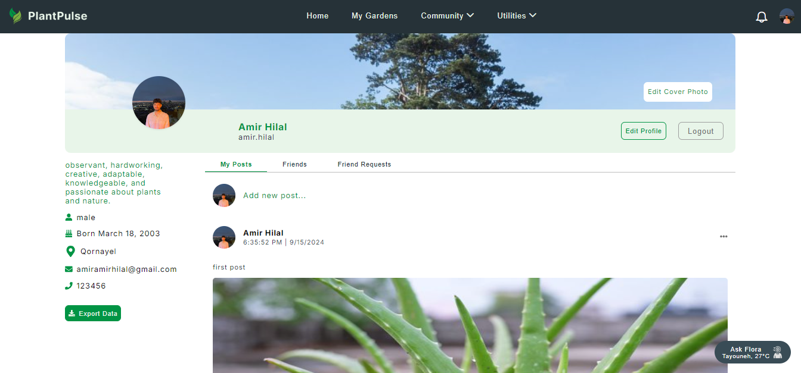
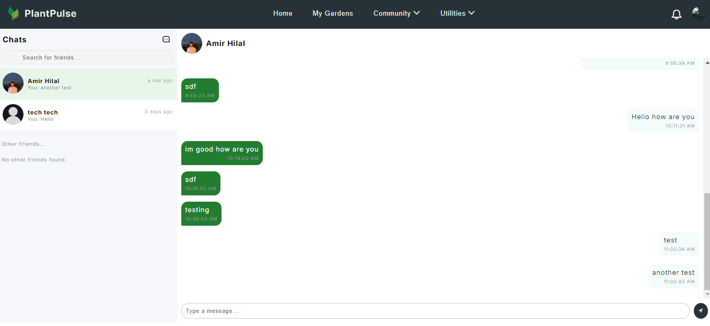
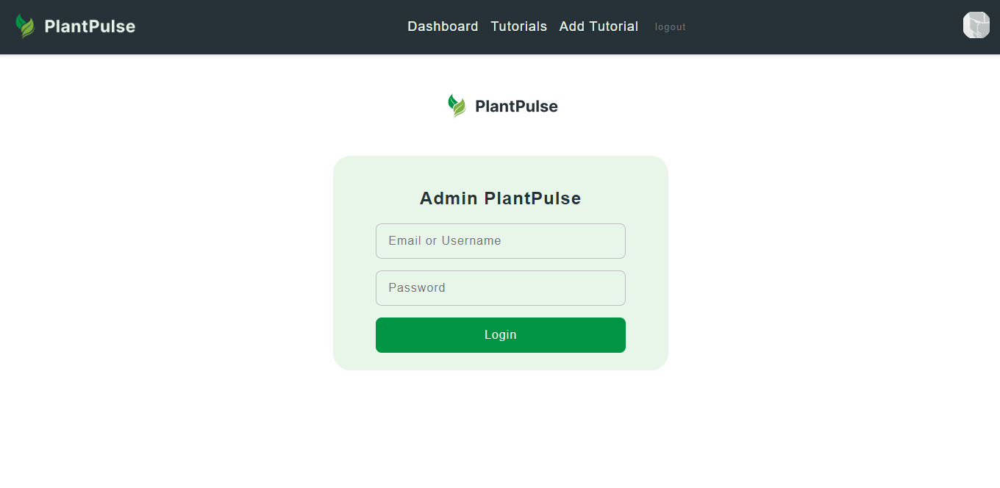

# PlantPulse


<br><br>

<!-- project philosophy -->


> PlantPulse is designed to revolutionize the way gardeners interact with their plants by leveraging modern technology. The philosophy behind PlantPulse centers on creating a comprehensive, user-friendly platform that supports both novice and experienced gardeners. By integrating advanced plant tracking, real-time weather updates, community features, and educational resources.
>
> PlanPulse offers features like voice commands and offline mode to ensure gardeners can easily manage their gardens anytime, anywhere.

### User Stories

## User

- As a user, I want to manage the plants in my various gardens by posting pictures and updates, so I can receive timely plant health notifications and watering reminders to ensure proper plant care.
- As a user, I want to access a comprehensive plant encyclopedia so that I can learn about various plant species and their care requirements.
- As a user, I want to connect with others in the industry and share my thoughts and ideas, fostering a community for exchanging knowledge and experiences.

## Admin

- As an admin, I want to manage the plant encyclopedia database so that the information remains accurate and up-to-date.
- As an admin, I want to moderate community content and user interactions so that the platform remains supportive and positive.
- As an admin, I want to analyze user data and feedback so that I can continually improve the app’s features and user experience.

<br><br>

<!-- Tech stack -->


### PlantPulse is built using the following technologies:

- The backend is powered by [Laravel](https://laravel.com/), a PHP framework used to handle authentication, database management, and server-side logic.
- The frontend is developed using [React](https://reactjs.org/), a JavaScript library for building user interfaces, and it uses [Redux](https://redux.js.org/) for state management.
- [Node.js](https://nodejs.org/) is used to integrate AI features via the OpenAI API for chatbot functionality.
- For real-time notifications and messaging, we use [Pusher](https://pusher.com/) integrated with Laravel.
- [JWT](https://jwt.io/) is utilized for authentication and session management.
- [OAuth](https://oauth.net/) is implemented for Google login using OAuth for seamless authentication.
- Email verification is handled through [Gmail SMTP](https://developers.google.com/gmail/), ensuring secure email communications.
- The chatbot is powered by [OpenAI GPT-4](https://openai.com/), with the integration managed through the Node.js service.
- Weather updates are fetched using the [OpenWeatherMap API](https://openweathermap.org/).
- The database is managed using [MySQL](https://www.mysql.com/), providing scalable and efficient storage solutions.
- The app’s primary font is ["Inter"](https://fonts.google.com/specimen/Inter), offering a clean and modern design.
- The admin dashboard is built using [Electron.js](https://www.electronjs.org/), allowing for a desktop application experience.

<br><br>

<!-- UI UX -->


> We designed PlantPulse using wireframes and mockups, iterating on the design until we reached the ideal layout for easy navigation and a seamless user experience.

- Project Figma design [figma](https://www.figma.com/design/6vG6pfrlHFuReMdGJPWMc6/WireFrames-and-Mockups?t=RMIBolqBS0xwboAh-0)

### Mockups

| Landing screen                             | Gardens Screen                           | Profile Screen                          |
| --------------------------------------- | ------------------------------------- | ------------------------------------- |
|  |  |  |

<br><br>

<!-- Database Design -->


### Architecting Data Excellence: Innovative Database Design Strategies:


<br><br>

<!-- Implementation -->


### User Screens (Web)

| Login screen                              | Register screen                         | Landing screen                          |
| ----------------------------------------- | --------------------------------------- | --------------------------------------- |
|  |  |  |
| Chats screen                               | Gardens Screen                             | Tutorials Screen                            |
|  |  |  |

### Admin Screens (Web)

| Login screen                            | Dashboard screen                       | Add Tutorial screen                        |
| --------------------------------------- | ------------------------------------- | ------------------------------------- |
|  |  |  |


<br><br>

<!-- Prompt Engineering -->


### Mastering AI Interaction: Unveiling the Power of Prompt Engineering:

- This project leverages advanced prompt engineering techniques to optimize the interaction with natural language processing models. The chatbot is powered by OpenAI's GPT-4, which is enhanced by real-time data inputs, including weather conditions and plant-specific data, to provide accurate and personalized responses to users.

- Additionally, we are training a custom model using [TensorFlow](https://www.tensorflow.org/), [Keras](https://keras.io/), [pandas](https://pandas.pydata.org/), [numpy](https://numpy.org/), [scikit-learn](https://scikit-learn.org/), [matplotlib](https://matplotlib.org/), and [Pillow](https://python-pillow.org/) on a dataset sourced from [Kaggle](https://www.kaggle.com/) to detect diseases from plant leaves. This model aids in managing the plant timeline by diagnosing plant health through image analysis. The results from this model are integrated into the OpenAI service, allowing for more insightful and contextually accurate responses, further improving plant care recommendations.

<br><br>

<!-- AWS Deployment -->


### Efficient AI Deployment: Unleashing the Potential with AWS Integration:

- This project leverages AWS deployment strategies to seamlessly integrate and deploy natural language processing models. With a focus on scalability, reliability, and performance, we ensure that AI applications powered by these models deliver robust and responsive solutions for diverse use cases.

<br><br>

<!-- Unit Testing -->


### Precision in Development: Harnessing the Power of Unit Testing:

- This project employs rigorous unit testing methodologies to ensure the reliability and accuracy of code components. By systematically evaluating individual units of the software, we guarantee a robust foundation, identifying and addressing potential issues early in the development process.

<br><br>

<!-- How to run -->


> To set up Coffee Express locally, follow these steps:

### Prerequisites

This is an example of how to list things you need to use the software and how to install them.

- npm
  ```sh
  npm install npm@latest -g
  ```

### Installation

_Below is an example of how you can instruct your audience on installing and setting up your app. This template doesn't rely on any external dependencies or services._

1. Get a free API Key at [example](https://example.com)
2. Clone the repo
   git clone [github](https://github.com/your_username_/Project-Name.git)
3. Install NPM packages
   ```sh
   npm install
   ```
4. Enter your API in `config.js`
   ```js
   const API_KEY = 'ENTER YOUR API';
   ```

Now, you should be able to run Coffee Express locally and explore its features.
