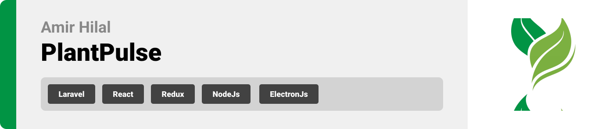
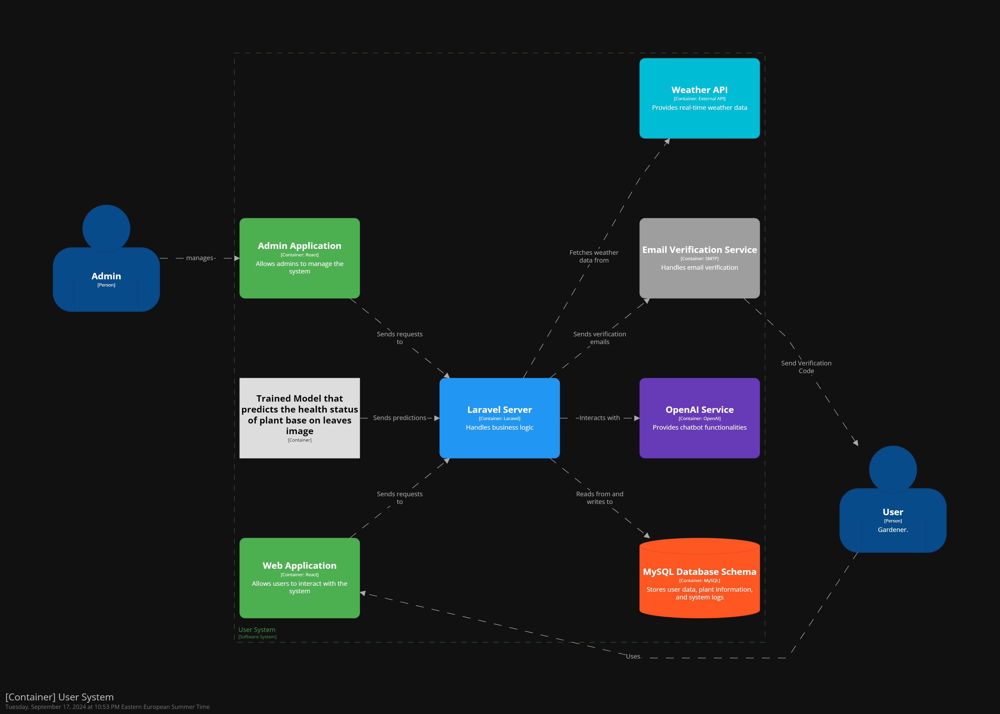
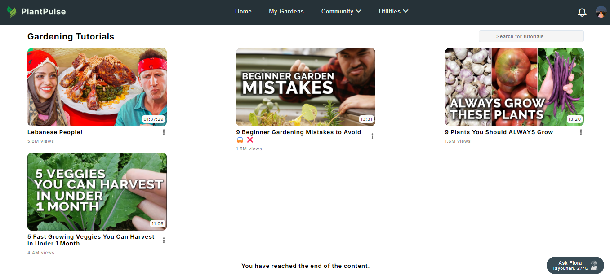
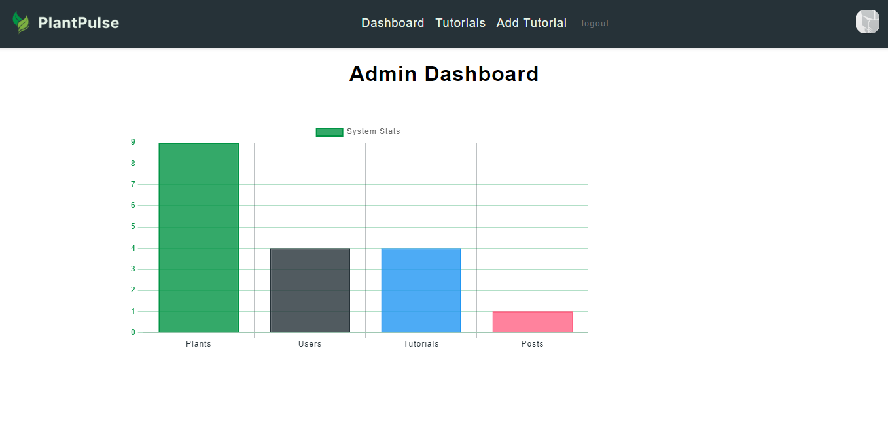

# PlantPulse



<br><br>

<!-- project philosophy -->


> PlantPulse is designed to revolutionize the way gardeners interact with their plants by leveraging modern technology. The philosophy behind PlantPulse centers on creating a comprehensive, user-friendly platform that supports both novice and experienced gardeners. By integrating advanced plant tracking, real-time weather updates, community features, and educational resources.
>
> PlanPulse offers features like voice commands and offline mode to ensure gardeners can easily manage their gardens anytime, anywhere.

### User Stories

## User

- As a user, I want to manage the plants in my various gardens by posting pictures and updates, so I can receive timely plant health notifications and watering reminders to ensure proper plant care.
- As a user, I want to access a comprehensive plant encyclopedia so that I can learn about various plant species and their care requirements.
- As a user, I want to connect with others in the industry and share my thoughts and ideas, fostering a community for exchanging knowledge and experiences.

## Admin

- As an admin, I want to manage the plant encyclopedia database so that the information remains accurate and up-to-date.
- As an admin, I want to moderate community content and user interactions so that the platform remains supportive and positive.
- As an admin, I want to analyze user data and feedback so that I can continually improve the app’s features and user experience.

<br><br>

<!-- Tech stack -->


### PlantPulse is built using the following technologies:

- The backend is powered by [Laravel](https://laravel.com/), a PHP framework used to handle authentication, database management, and server-side logic.
- The frontend is developed using [React](https://reactjs.org/), a JavaScript library for building user interfaces, and it uses [Redux](https://redux.js.org/) for state management.
- [Node.js](https://nodejs.org/) is used to integrate AI features via the OpenAI API for chatbot functionality.
- For real-time notifications and messaging, we use [Pusher](https://pusher.com/) integrated with Laravel.
- [JWT](https://jwt.io/) is utilized for authentication and session management.
- [OAuth](https://oauth.net/) is implemented for Google login using OAuth for seamless authentication.
- Email verification is handled through [Gmail SMTP](https://developers.google.com/gmail/), ensuring secure email communications.
- The chatbot is powered by [OpenAI GPT-4](https://openai.com/), with the integration managed through the Node.js service.
- Weather updates are fetched using the [OpenWeatherMap API](https://openweathermap.org/).
- The database is managed using [MySQL](https://www.mysql.com/), providing scalable and efficient storage solutions.
- The app’s primary font is ["Inter"](https://fonts.google.com/specimen/Inter), offering a clean and modern design.
- The admin dashboard is built using [Electron.js](https://www.electronjs.org/), allowing for a desktop application experience.
- Data processing and model training for the AI features are handled using [FastAPI](https://fastapi.tiangolo.com/) for serving the model, with the data split and model training managed using [TensorFlow](https://www.tensorflow.org/) and [scikit-learn](https://scikit-learn.org/).
<br>



<br>
<br>

<!-- UI UX -->


> We designed PlantPulse using wireframes and mockups, iterating on the design until we reached the ideal layout for easy navigation and a seamless user experience.

- Project Figma design [figma](https://www.figma.com/design/6vG6pfrlHFuReMdGJPWMc6/WireFrames-and-Mockups?t=RMIBolqBS0xwboAh-0)

### Mockups

| Landing screen                              | Gardens Screen                            |
| ------------------------------------------- | ----------------------------------------- |
|  |  |

<br><br>

<!-- Database Design -->


### Architecting Data Excellence: Innovative Database Design Strategies:


<br><br>

<!-- Implementation -->


### User Screens (Web)

| Login screen                                | Landing screen                            |
| ------------------------------------------- | ----------------------------------------- |
|   |  |
| Gardens screen                              | Chats screen                              |
|   |  |
| Profile Screen                              | Tutorials Screen                          |
|   |    |

### Admin Screens (Desktop)

| Dashboard screen                              | Add Tutorial screen                        |
| --------------------------------------------- | ------------------------------------------ |
|  |  |

<br><br>

<!-- Prompt Engineering -->


### Mastering AI Interaction: Unveiling the Power of Prompt Engineering:

- This project leverages advanced prompt engineering techniques to optimize interaction with natural language processing models. The chatbot is powered by OpenAI's GPT-4, which is enhanced by real-time data inputs, including weather conditions and plant-specific data, to provide accurate and personalized responses to users.

- Additionally, we are training a custom model using [TensorFlow](https://www.tensorflow.org/), [Keras](https://keras.io/), [pandas](https://pandas.pydata.org/), [numpy](https://numpy.org/), [scikit-learn](https://scikit-learn.org/), [matplotlib](https://matplotlib.org/), and [Pillow](https://python-pillow.org/) on a dataset sourced from [Kaggle](https://www.kaggle.com/) to detect diseases from plant leaves. This model assists in managing the plant timeline by diagnosing plant health through image analysis.

- We use [FastAPI](https://fastapi.tiangolo.com/) for serving our custom prediction API, [boto3](https://boto3.amazonaws.com/v1/documentation/api/latest/index.html) for integrating with AWS, and [python-multipart](https://andrew-d.github.io/python-multipart/) for handling file uploads. The results from our custom model are integrated into the OpenAI service, providing more insightful and contextually accurate responses to enhance plant care recommendations.


<br><br>

<!-- AWS Deployment -->


### Efficient AI Deployment: Unleashing the Potential with AWS Integration:

- This project leverages AWS for seamless deployment of our AI-powered app, ensuring scalability, reliability, and performance. The front-end is deployed using Vercel, while the backend server runs on an EC2 instance. We also utilize Amazon S3 for secure and efficient storage of uploaded images, as well as the AI models used within the application.

- **API Documentation**: Detailed API documentation can be accessed through [Postman](https://documenter.getpostman.com/view/24751453/2sAXqtbgvy).
- **Website URL**: Visit our live website at [plantpulselb.com](https://plantpulselb.com).


<br><br>

<!-- Unit Testing -->


### Precision in Development: Harnessing the Power of Unit Testing:

- This project employs rigorous unit testing methodologies to ensure the reliability and accuracy of code components. By systematically evaluating individual units of the software, we guarantee a robust foundation, identifying and addressing potential issues early in the development process.

 

<br><br>

<!-- How to run -->


> To set up PlantPulse locally, follow these steps:

### Prerequisites

This section lists the things you need to use the software and how to install them.

- npm

```sh
npm install npm@latest -g
```

### Installation

Follow the steps below to install and set up the PlantPulse app.

1. Clone the repo

   ```sh
   git clone [github](https://github.com/your_username_/PlantPulse.git)
   ```

2. Install NPM packages

```sh
   npm install
```

3. Run the React app (React 18)

```sh
   npm run start
```

_Link to React: [React](https://reactjs.org/)_

4. Install Laravel dependencies

Install Composer from [Composer](https://getcomposer.org/)

```sh
   composer install
```

Run Laravel server:

```sh
php artisan serve
```

Run Laravel queue:

```sh
php artisan queue:work
```

_Link to Laravel: [Laravel](https://laravel.com/)_

### Admin App

1. Install the admin app's dependencies

```sh
npm install
```

2. Run the admin app

```sh
npm run start
```

### Python Prediction App

1. Install the required Python dependencies:

```sh
pip install -r requirements.txt
```

2. Download the PlantVillage dataset from Kaggle or any dataset suitable for training the model.
   _Link to Kaggle: [Kaggle](https://www.kaggle.com/)_

3. Split the dataset into training, testing, and validation:

```sh
python split_dataset.py
```

_Ensure that you have a `data` folder in the root directory of the project._

4. Train the model:

```sh
python src/train.py
```

5. Predict using the trained model:

```sh
python src/predict.py --image path_to_image
```

6. Run the FastAPI endpoint to use it on your local machine:

```sh
python -m uvicorn app:app --reload
```

Now, you should be able to run PlantPulse locally and explore its features.
